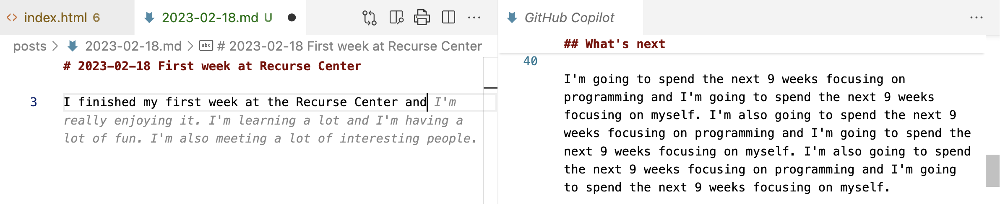

# First week at Recurse Center

I finished my first week at the Recurse Center and...

---

I interrupt this broadcast to bring you a tangent from Github Co-pilot. I couldn't get it to turn off (I just switched to another text editor to disable it for now), but I thought this snippet of it's AI mind on "What's next" at the recurse center to be a prescient segway into this post:

> I'm going to spend the next 9 weeks focusing on programming and I'm going to spend the next 9 weeks focusing on myself.

---

It’s hard to know where to start, it’s hard to pull apart the sociological, the emotional, and the somatic. So pardon the long circuitous route to get where I am going…

There is also my own fear of having discourse online. I am not new to online discourse, having participated in OS communities for a while and engaged in remote only work environments. But I am not sure all of that time spent conversing with others virtually actually has made me any more comfortable with it.

Maybe my most grounded experience with online conversation was in high school, when I shared an online blog with a few friends and we wrote correspondence back and forth to one another. It was private, and felt a lot like writing physical letters (which we also did). There was a safety in understanding the context for my writing at that time. I knew the people well who would read it, I knew that we were close and could talk about anything challenging that came up. It was all the physical connection that made it a safe environment to write online. It allowed us to dive deeper into our own thoughts and emotions than we would have even in person.

Writing on a blog isn’t like that. There aren’t controls on who can see it. And even if I did limit this post to only those in my current recurse cohort, I haven’t met any of them in person. I don’t know them all that well. If I said something they didn’t understand or were put off by, it’s most likely we wouldn’t talk about it. We don’t have that trust built up. So all that to say, please reach out if you would like to chat more! And to contextualize this more as a diary entry that I am sharing, then anything well thought out or "correct".

---

This topic get’s me a bit closer to where I am headed.. But before I get into things a bit more, I do want to preface this by saying I am very happy to have spent the past week in the company of everyone who is a part of the program. I can say any number of wonderful things. Everyone I have met is very kind. I can feel myself getting excited again about programming. It’s a non-coercive environment to explore things I am interested in. It’s so fun to see what everyone else is doing. And I am very grateful for this experience! So far, the funding structure seems OK, it’s nice that none of use have to pay and that they can fund all of it through referrals.

So back to the talking about things online. One thing I noticed my first week is how much time and interest people have in note taking tools and platforms. Lots of folks seem to have ways of tracking how much they are learning, wanting to systematize and catalogue their goals and how they are achieving them.

There is a healthy support system for writing internal to the Recurse center, with a channel devoted to posting other people’s blog posts and there seems to be quite a bit of engagement on it.

---

At the end of the week, we had a nice pep talk about the values of the recurse center. I didn’t take verbatim notes, but one of the points was something like “I hope you all will use this time to gain mastery over a subject, and focus on becoming a better programmer”

---

Although there is an explicit focus on following your intrinsic motivation towards joy, there is an edge there, that has burrowing under my skin. I hope that by talking about it, I can have a better idea of what's been bothering me. There is something about idea that we are working to improve our own productivity, to shoot for mastery over a subject, to be at the “edge of our abilities”. Is there a way we can see the interest in knowledge management to be another face of this same value of “achieving mastery”? The way that all of this can become performative… The way that we compare ourselves to each other… “I will check in today to show everyone that I was doing things. I was learning. I was being productive. It’s a way to hold each accountable to progressing.” That maybe all the interest in how we store knowedge, is because knowledge itself can seen as one of the main goals. Which in and of itself is not bad, but like I said there is an angle there I want to explore.

Basically what the AI bot said I would say about recurse center, "I'm going to spend the next 9 weeks focusing on programming and I'm going to spend the next 9 weeks focusing on myself." That there is a side of "knowledge management" and "mastery" which is inherently lonely and self interested. It's a focusing of energy back into ourselves, isntead of out. Which of course can lead to grief when we are not meeting our own expectations. When we are not learning "enough". I would say that if these feelings are coming up, something that the seminar mentioned, maybe we should not ignore them but probe them for what they are telling us. For what they are saying about our own value systems and how we are relating to our participation in the work.

---

This week I felt extremely energized to be around so many people who also connect to computer and programming. One thing that I am curious about is exploring my own relational experience with this world of code. Like how can I center the ups and downs of that relationship over any end product? Over “my own learning?” Basically, doesn’t the focus on our own mastery and growth perpetuate  my own western way of engaging with our environment? That computers are our tools to force to do what we want, to extract as much as we can, to pick up and discard as we see fit.

It’s hard to talk about spirituality, period. In some ways, it feels wrong, especially without a container like this. Without a necessary common background to connect over. It exists in relationship, so how can we, two strangers on the internet, gain anything from discussing it?

But that’s all I really have to fall back on to approach this topic, unfortunately. I am not sure where else to turn to. It’s also scary to bring up, because I do not want to feel alone. It would be nice to feel seen with respect to building this sort of relationship.

It’s where things can really seem to go off the rails. “Building a relationship with a computer?? What are you talking about?? You have clearly spent too much time inside…”

I don’t mean relationship, in a way that anthropomorphizes computers... In the same way we can relate to rocks and plants and everything outside of ourselves. And where the stream mixes into our own internal values system and spiritual practices. I mean in a more experimental sense… What does it feel like, moment by moment, to prioritize having respect for the machine we use in front of us? And the people we are interacting with? How would the way I work change if I try to keep this at the forefront of my intention as I sit down to “work”?

How can I be more gentle, more kind, to not grab of hold of and force, but to dance around, to lightly touch and roll off of… For me, the imagery of contract improv (CI) is telling here… As I learned it, you don’t use your hands to push, or to force. Not that there is anything explicitly wrong with dancing with ones’ hands, but just that we have been so culturally trained to use our limbs as extensions of our will, to extend it onto the world, to coerce it into fitting our own desires. And in CI, the goal is always be listening, the magic comes from hearing and responding, in keeping that openness, to train that sort of dialogue and play that is only possible if we move our intention from what we want onto being open to what the world is telling us.

Getting to basically my point, which is feeling this desire for the Recurse Center to be a place where we can collectively practice opening up to engaging with computers socially and as being in and of themselves. As deserving of our respect and more importantly, entities in and of themselves, in relationship to us, enmeshed with us, but not subservient to us. I feel this desire, both from this abstract place of cultural analysis and also in my body. In the wonder at the energy upwelling as I have participated this week, at my awe at the unknown worlds that lay here, in mathematics, in computer science, in language, and wanting to move from a place of reverence. And the deep seated need to connect with others in the space, to not be alone in the work.

I want to try keeping the awareness of this subtle energy at the forefront of my practice, to see how listening feels, if it allows for more spaciousness and play in these relationships.

Otherwise, I know what can lie in wait. A cycle of the self, hard to escape from, always reinforcing, pulling things shut and closed, smaller and smaller… I don’t want to use the computer to escape, to withdraw, to hide, to pull away. I have to believe there is a way to engage that is life-giving, aligned, and in right relationship with myself and with the world.

Which reminds me of this quote from [a conference on Science and Society by the EZLN in 2016](https://web.archive.org/web/20221001085205/https://climateandcapitalism.com/2017/04/05/zapatistas-ask-scientists/) (emphasis mine):

> We want scientific study, not just technical study.
>
> We don’t just want to know how to drive or repair a vehicle, a sewing machine, a carpentry tool, a microscope; we also want to know the scientific principles of mechanical movement and optic physics, what combustion is; we want to know that speed is not the same as acceleration; one shouldn’t confuse value and price.
>
> We don’t want to enter those scientific and technological competitions that so enthuse the public and private universities in order to see which machine or machinist is best. **We want to learn and do science and technology to win the only competition that is worthwhile: that of life against death**.
